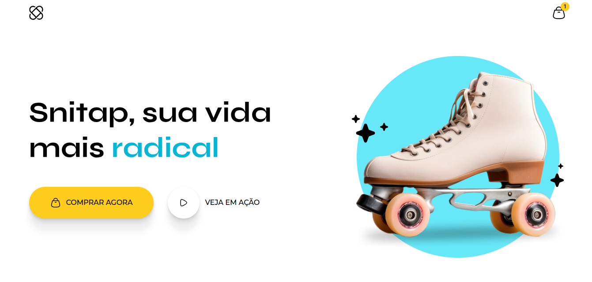

# 🛼 Patins Animation

Animação leve e criativa feita com **HTML** e **CSS puro**, inspirada na fluidez dos movimentos do patins. Este projeto é parte dos meus estudos sobre **animações web responsivas**, com foco em transições suaves e visuais modernos.

 <!-- Altere para o caminho correto se quiser adicionar um GIF ou imagem de preview -->

## ✨ Tecnologias Utilizadas

- HTML5
- CSS3 (animações, keyframes, transformações e transições)
- Responsividade básica

## 🎯 Objetivo

O objetivo deste projeto é explorar o potencial de animações CSS para criar efeitos visuais dinâmicos sem depender de JavaScript. A ideia central gira em torno do movimento fluido — assim como os patins deslizando — representado com elementos simples, limpos e modernos.

## 🛠 Como visualizar o projeto

Você pode clonar o repositório e abrir o arquivo `index.html` diretamente no navegador:


💡 Aprendizados
Prática com @keyframes e transições CSS

Uso de transform: rotate / scale / translate

Controle de tempo e delays para criar efeitos naturais

📌 Status
✅ Projeto finalizado — pode ser melhorado futuramente com responsividade total e novas variações de movimento.

🙋‍♂️ Autor
Feito com dedicação por Jeferson Gutierrez
LinkedIn | Portfólio

```bash
git clone https://github.com/ghutttyerrez/patins-animation.git
cd patins-animation


